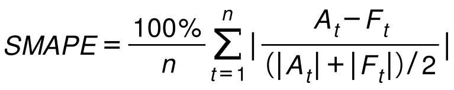
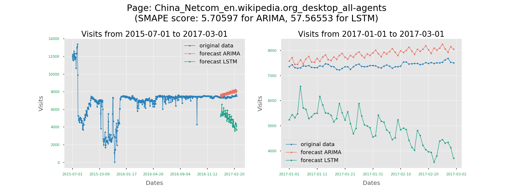
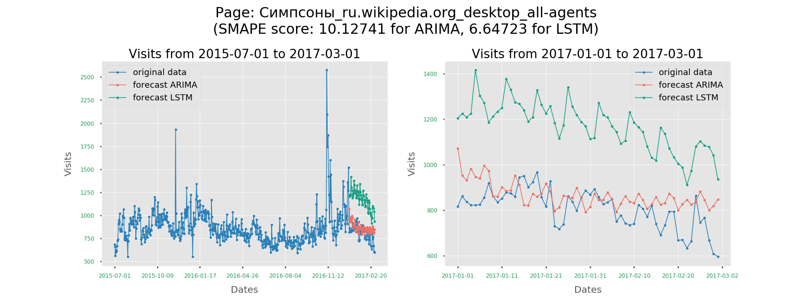

# Web Traffic Forecasting

This repository contains various algorithms implemented on web traffic time series forecasting which are completed on CSCI 8360, Data Science Practicum at the University of Georgia, Spring 2018.

This project uses the time series web visits on Wikipedia from Kaggle competition [Web Traffic Time Series Forecasting](https://www.kaggle.com/c/web-traffic-time-series-forecasting). The dataset contains the visits record of approximately 145,000 pages on Wikipedia, from 07/31/15 to 12/31/16 for training set 1 and 07/31/15 to 09/01/17 for training set 2.
In the training set, each row represents a visit series of a page and each column represents a day between the target time period. The pages are categorized into different names, projects, access, and agents as:

- **Names**: page names
- **Projects**: website language as Deutsch (de), English (en), Spanish (es), French (fr), Japanese (ja), Russian(ru), Chinese(zh),	mediawiki, commons.wikimedia
- **Accessibility**: type of access as all-access, desktop, mobile
- **Agent**: Type of agent as all-agents, spider

In this repository, we are offering two different methods as follows using different packages to forecast the following two months web visit of 145k pages:

1. Autoregressive Integrated Moving Average model using repackaged itsm
2. Long Short-term Memory model using keras

Read more details about each algorithm and their applications in our [WIKI](https://github.com/dsp-uga/Edamame/wiki) tab, or visit our website ([Edamame.](https://dsp-uga.github.io/Edamame/)) to follow the process flow.


## Getting Started

These instructions will get you a copy of the project up and running on your local machine for development and testing purposes.

### Prerequisites

- [Python 3.6](https://www.python.org/downloads/release/python-360/)
- [Anaconda](https://www.anaconda.com/)

### Environment Setting

  1. **Clone this repository**
  ```
  $ git clone https://github.com/dsp-uga/Edamame
  $ cd Edamame
  ```

  2. **Setup the environment**
  ```
  $ python setup.py
  ```

## Running the tests

```
python -m [algorithm] [args-for-the-algorithm]
```

##### Algorithms

    - `ARIMA`: Running Autoregressive Integrated Moving Average model
    - `LSTM`: Running Long Short-term Memory model

Each folders includes one module and you can run it through the command above. Each module provides their own arguments, use `help()` to know more details when running the algorithms.


## Evaluation

The results count on the mean SMAPE (Symmetric Mean Absolute Percent Error) scores for 145k pages.
SMAPE is an alternative method to MAPE when there are zero or near-zero demand for items. Since the low volume items have infinitely high error rates that skew the overall error rate, SMAPE self-limits to an error rate of 200% and reduces the influence of low volume items.

<p align="center">

</p>

## Test Results

train_1 is the training set 1 of web visits from 07/31/15 to 12/31/16, and train_2 is the training set 2 of web visits from 07/31/15 to 09/01/16.

#### ARIMA

| Preprocessing   | Training set                   | # of pages | Mean SMAPE |
|-----------------|--------------------------------|------------|------------|
| fill nan with 0 | train_1, high sd, stationary   | 1,867      | 39.6649    |
| fill nan with 0 | train_1, high sd, stationary   | 2,075      | 39.4344    |
| fill nan with 0 | train_1, high sd, stationary   | 2,340      | 38.965     |

#### LSTM
| Preprocessing   |  Model structure     | Batch Size | Epochs |Mean SMAPE|
|-----------------|----------------------|------------|--------|----------|
| fill nan with 0 | LSTM(50) + Dense(60) | 3000       | 30     | 61.9849  |
| fill nan with 0 | LSTM(50) + Dense(60) | 5000       | 30     | 61.2177  |
| fill nan with 0 | LSTM(50) + Dense(60) | 10000      | 50     | 55.4024  |
| fill nan with 0 | LSTM(50) + Dense(60) | 10000      | 70     | 53.8052  |
| fill nan with 0 | LSTM(50) + Dense(60) | 10000      | 100    | 59.2045  |


## Discussion

#### ARIMA

- Has relatively high SMAPE score than LSTM and works well for short-run forecasts with high frequency data
- High coast and super time consuming (100 days for 145k pages on training set 1)
- Strict assumptions check before fitting models
    - stationarity check for ARMA model
    - autocorrelation, seasonal components, and trend components for ARIMA model
- Nice forecast with SMAPE score 7.7685 for ARIMA:
<p align = "center">
  
</p><br><br>

#### LSTM

- A lot faster than ARIMA (only 20 mins for 20 epochs) and not sensitive to non-stationary data
- Starts to forget what happened very long ago (limit is 400 days)
- Below is an example of SMAPE value distribution for LSTM model. We can see there are quite a few outliners with SMAPE value of 200.
<p align="center">
<br><br>
</p>
<ul>
<li> Then for those with SMAPE value of 200, if we plot their raw data and predicted data, we can see the raw data are all 0. After inspecting the original data, we found quite a few pages have 0 visit throughout the entire time series.
</ul>
<p align="center">
<br><br>
</p>

#### Performance comparisons between two models
<br>
<p align="center">
<br><br>

</p>

## Further Improvement

#### ARIMA
- Time consuming is not solvable if we are still fitting each page one by one. Detacting high autocorrelation values by specific threshold and assigning the parameters of seasonal and trend components might reduce the time on augmented Dickey-Fuller test which is not as robust as expected.

#### LSTM
- A good way of avoiding those [200 SMAPE values ](https://github.com/dsp-uga/Edamame#lstm-1) could be to remove those pages with 0 visit throughout the entire time series for training. However, There are 752 such series in train_1. if we extend the time to the end of our final prediction date, it will be 38 pages being 0 for the whole time. This means there are 714 pages that we have to make prediction out of nothing...

- Also, it might be helpful to train different models for different page categories. For example, different models for pages with different languages.

- A [solution](https://github.com/Arturus/kaggle-web-traffic/blob/master/how_it_works.md#working-with-long-timeseries) for the memory issue of LSTM proposed by 1st place winner of this kaggle competition is to use information from certain time period ago as additional features to feed into LSTM model.

## Authors
(Order alphabetically)

- **I-Huei Ho** - [melanieihuei](https://github.com/melanieihuei)
- **Weiwen Xu** - [WeiwenXu21](https://github.com/WeiwenXu21)

See the [CONTRIBUTORS](CONTRIBUTORS.md) file for details.

## License

This project is licensed under the MIT License - see the [LICENSE.md](LICENSE) file for details
